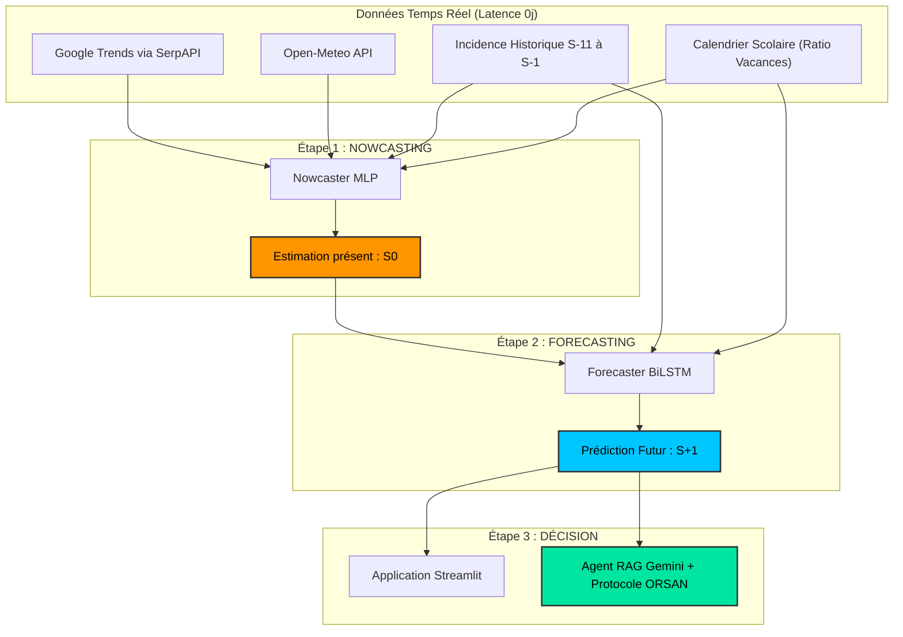

# 🏥 EPI·TRACE — Système d'Aide à la Décision Hospitalière en Temps Réel

[](https://www.python.org/)
[](https://streamlit.io/)
[](https://tensorflow.org/)
[](http://www.ensam.umi.ac.ma/)

**Epi-Trace** est un système intelligent d'aide à la décision hospitalière conçu pour prédire la charge et l'incidence des urgences médicales en Île-de-France à **J+7**. 

L'innovation majeure d'Epi-Trace réside dans sa capacité à surmonter la **latence de 12 jours** du réseau Sentinelles (INSERM) en reconstruisant le présent (*Nowcasting*) via des signaux exogènes (Google Trends et données météorologiques) pour alimenter ensuite une prévision à court terme (*Forecasting*).

---

## 🎯 Le Défi & L'Innovation : La Cascade d'IA

### Le Problème (La fenêtre aveugle de 12 jours)
Le réseau Sentinelles publie les données d'incidence de la grippe/toux avec un décalage de **~12 jours**. En période épidémique, un directeur d'hôpital est aveugle face à la vague actuelle et ne peut activer le Plan Blanc qu'en réaction, jamais en anticipation.

### Notre Solution (L'architecture en cascade)
Epi-Trace combine deux modèles de Deep Learning pour éliminer cette latence :
1. **Le Nowcaster (MLP BiLSTM allégé)** : Estime l'incidence de la semaine en cours ($S_0$) sans aucune donnée clinique, en utilisant uniquement les recherches Google (Google Trends) et les conditions météo actuelles.
2. **Le Forecaster (BiLSTM)** : Utilise l'incidence estimée par le Nowcaster pour prédire avec précision la charge hospitalière de la semaine prochaine ($S_{+1}$).



---

## 📊 Preuves Statistiques et Métriques Réelles

Chaque variable exogène a été validée par des tests rigoureux de **corrélation de Pearson** et de **causalité de Granger** dans nos notebooks :

### Validation Exogène (Pearson & Granger)
* **Recherches Google (Toux/Grippe)** : Corrèlent fortement avec l'incidence ($r = +0.84$ et $+0.81$) avec un **lag optimal de 0 semaine** (signaux synchrones).
* **Météo (Température/Humidité)** : Causalité prouvée par Granger (lag optimal de 4 semaines pour la température, $p = 0.0185$).
* **Ratio de vacances scolaires** : Variable continue inventée et validée par OLS ($p = 0.00015$). L'entrée en vacances scolaires réduit en moyenne l'incidence de **6 254 cas/semaine** en Île-de-France.

### Comparaison des Modèles de Prévision ($S_{+1}$)

| Métrique | SARIMAX (Baseline) | Prophet (ML) | BiLSTM (Epi-Trace DL) | Nowcaster (MLP Delta) |
|---|---|---|---|---|
| **MAE** (cas) | 6 122 | 3 997 | **3 095** | — |
| **RMSE** (cas) | 7 139 | 5 391 | **4 083** | **2 633** |
| **R²** | 0.177 | 0.531 | **0.731** | **0.892** |
| **MAPE** (%) | 60.4% | 31.1% | **27.6%** | **14.9%** |

* **Sécurité Sanitaire (Recall)** : Binarisé au seuil critique du $85^e$ percentile, le modèle obtient un **Rappel de 100%** (zéro fausse alerte négative pour les crises sanitaires).

---

## 📂 Structure du Projet

```text
EpiTrace/
│
├── app/
│   ├── app.py                  # Centre de commandement tactique (Streamlit) gérant l'interface et les modes
│   └── app_utils.py            # Chargement des modèles d'IA (MLP/BiLSTM), pré-traitements et calculs de percentiles
│
├── src/
│   ├── extract_sentinelles.py  # Téléchargement et filtrage régional de la vérité terrain (Sentinelles)
│   ├── extract_trends.py       # Scraping des tendances de recherche de symptômes via SerpAPI
│   ├── extract_meteo.py        # Extraction de l'historique météo horaire via Open-Meteo API
│   └── agent_llm.py            # Moteur RAG qui bride le LLM Gemini avec les directives médicales
│
├── notebooks/
│   ├── 01_eda_et_correlation.ipynb  # Preuves statistiques complètes (Pearson, Granger Causality, OLS)
│   ├── 02_modelisation.ipynb        # Benchmark d'apprentissage (SARIMAX, Prophet, BiLSTM) et diagnostics
│   └── epi_trace_nowcast.keras      # Poids entraînés du modèle de Nowcasting pour la production
│
├── data/
│   ├── brutes/                 # Fichiers CSV bruts directement extraits des sources et APIs
│   └── traitees/               # Cubes OLAP finaux (alignement temporel ISO) pour l'entraînement et le live
│
├── docs/
│   └── protocole_orsan_reb.md  # Fichier de référence contenant le protocole de crise ministériel ORSAN
│
├── build_live_cube.py          # Script ETL d'orchestration qui aligne en direct les 3 APIs pour générer le cube live
├── requirements.txt            # Dépendances du projet (TensorFlow, Streamlit, Pandas, Scikit-learn, etc.)
└── .gitignore                  # Configuration des fichiers ignorés par Git (fichiers d'environnement, env virtuels, caches, etc.)
```

---

## 🛠️ Démarrage Rapide (Installation)

### Prérequis
* Python 3.9 à 3.11
* Un compte [SerpAPI](https://serpapi.com/) (pour rafraîchir Google Trends en temps réel - clé gratuite suffisante)
* Une clé d'API Google Gemini (pour faire tourner l'agent IA décisionnel)

### 1. Clonage du dépôt et environnement
```bash
git clone https://github.com/YahyaAmajane/EpiTrace.git
cd EpiTrace
python -m venv venv
venv\Scripts\activate      # Sur Windows
source venv/bin/activate    # Sur macOS/Linux
```

### 2. Installation des dépendances
```bash
pip install -r requirements.txt
```

### 3. Fichier de Configuration (`.env`)
Créez un fichier `.env` à la racine du projet avec vos clés d'APIs :
```env
SERPAPI_KEY=votre_cle_serpapi_ici
GEMINI_API_KEY=votre_cle_gemini_ici
```

### 4. Lancement de l'Application & Mode Démo

Pour démarrer l'application, deux approches sont possibles selon que vous souhaitez générer de nouvelles données en direct ou utiliser notre jeu de données de démonstration pré-configuré :

#### Option A : Exécuter avec les données de Démo (Recommandé pour un test rapide)
L'application est configurée pour s'exécuter directement sans clé API supplémentaire en utilisant le fichier `data/traitees/epitrace_cube_live.csv` pré-rempli. Ce fichier contient l'historique stable aligné et nettoyé jusqu'à aujourd'hui.
Lancez simplement l'application Streamlit :
```bash
streamlit run app/app.py
```

#### Option B : Mettre à jour les données en direct (ETL complet)
Si vous souhaitez interroger les APIs en temps réel et générer un nouveau cube de données actualisé, lancez d'abord le pipeline ETL :
```bash
python build_live_cube.py
```
*Note : Cette étape nécessite que vous ayez renseigné votre `SERPAPI_KEY` dans le fichier `.env` pour récupérer les dernières données Google Trends.*

Une fois le cube reconstruit en direct, vous pouvez lancer l'application pour générer des prévisions basées sur ces nouvelles données :
```bash
streamlit run app/app.py
```

L'application sera accessible dans votre navigateur à l'adresse : `http://localhost:8501`.

---

## 🖥️ Fonctionnalités du Dashboard
* **Tableau de Bord Stratégique** : Suivi des indicateurs clés et niveau d'alerte Orsan automatique (Veille, Pré-alerte, Plan Blanc, Alerte Rouge) basé sur les percentiles réels.
* **Moteur de Prévision interactif** : Choix du mode opérationnel (Standard si Sentinelles est publié, Urgence si Sentinelles a du retard avec exécution de la Cascade d'IA).
* **Signaux Précurseurs** : Superposition dynamique de Google Trends/Météo avec l'incidence clinique, et heatmap de corrélation 7x7.
* **Agent IA RAG (Gemini)** : Rédaction automatisée et sécurisée (sans hallucination) d'un bulletin d'alerte médicale téléchargeable, basé sur le protocole officiel ORSAN.
* **Simulateur What-If** : 7 sliders pour tester l'impact climatique, social ou numérique sur la charge hospitalière de la semaine prochaine.

---

## 👥 Auteurs
* **Yahya Amajane**
* **Mohamed Amine Belasri**

*ENSAM Meknès — Filière IATD-SI *
